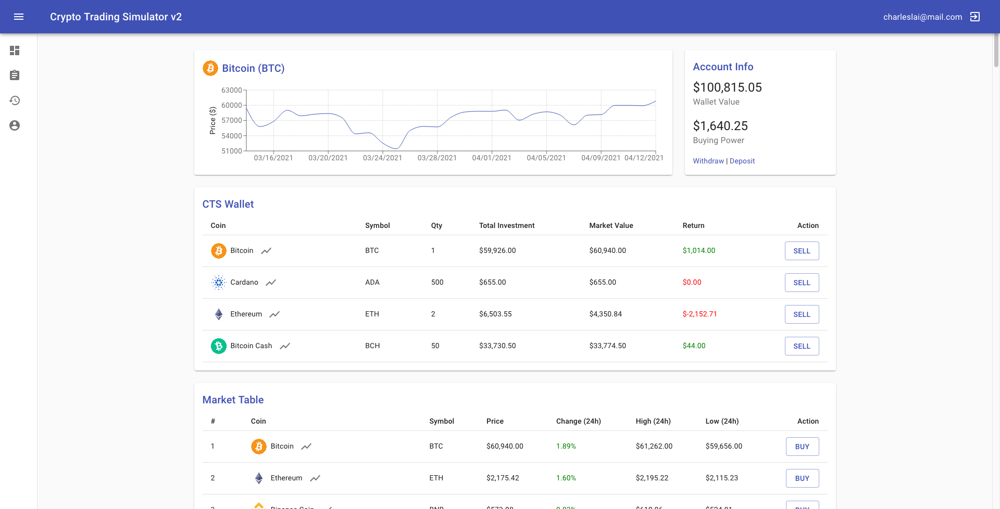

# Crypto Trading Simulator v2 (Frontend)

Crypto Trading Simulator v2 is a React web app that simulates a cryptocurrency trading platform. This web app will have the same features as it did v1 with new features such as a chart component that plots the 30 day price change of a cryptocurrency, updated model associations that will help us keep track of the positions of a user and their trade history, and a transactions table. Redux will be used to handle our state management. We will be utilizing Axios to send async calls to our server. Our backend will be setup as a Rails API and we will be making use of Active Model Serializers to serialize the data we’re sending back to the frontend.

### Preview



### Backend Repo

[Crypto Trading Simulator v2 (Backend)](https://github.com/charlesangelolai/crypto-trading-simulator-v2-backend)

## Installation

1. Clone GitHub repository.

```bash
$ git clone https://github.com/charlesangelolai/crypto-trading-simulator-v2-frontend
```

2. Run the command below to install the dependencies. (Pre-requisit: Yarn)

```bash
$ yarn install
```

3. Navigate to the backend repository and follow the instructions.

## Usage

1. Run yarn start inside the project folder's console

```bash
$ yarn start
```

2. Signup or Login with a new/existing user account.

3. Start trading!

## License

[](https://opensource.org/licenses/MIT)
